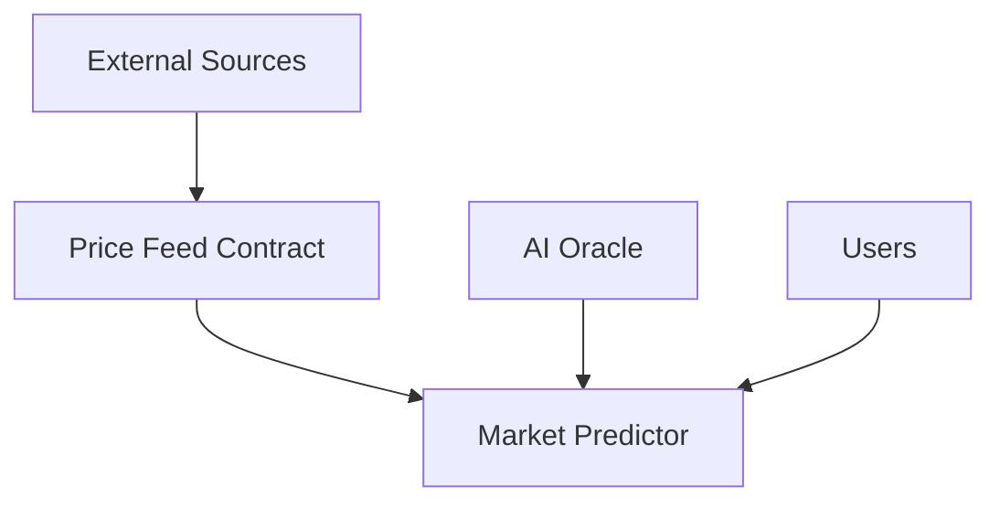

# AI Stock Market Prediction - Architecture Documentation

## System Overview
The system consists of multiple smart contracts working together to provide reliable stock market predictions using AI and on-chain data aggregation.

### Core Components

1. **Market Predictor Contract**
   - Primary interface for prediction submissions
   - Validates and stores predictions
   - Manages confidence scores
   - Access control for authorized predictors

2. **Price Feed Contract**
   - Aggregates price data from multiple sources
   - Implements weighted average calculation
   - Ensures data freshness and reliability
   - Manages source authorization

3. **AI Oracle Contract**
   - Interfaces with external AI models
   - Validates prediction inputs
   - Manages model versioning

### Security Architecture

#### Access Control
- Role-based access control (RBAC) implementation
- Contract owner privileges
- Authorized source management
- Multi-signature requirements for critical operations

#### Data Validation
- Input boundary checking
- Timestamp validation
- Source authentication
- Data freshness verification

#### Price Feed Security
- Minimum source requirement (n>3)
- Weight-based aggregation
- Stale data protection
- Source reputation tracking

### Data Flow
1. External sources submit price data through authorized endpoints
2. Price feed contract aggregates and validates submissions
3. AI models process validated data
4. Market predictor contract stores and manages predictions
5. Users can query predictions with confidence scores

### Upgrade Path
- Contracts implement version control
- Admin functions for contract updates
- Data migration capabilities
- Backward compatibility considerations

## Technical Implementation

### Smart Contract Interaction

### State Management
- Persistent storage using maps
- Temporary state variables
- Event logging for tracking

### Error Handling
- Comprehensive error codes
- Graceful failure handling
- Transaction rollback mechanisms
